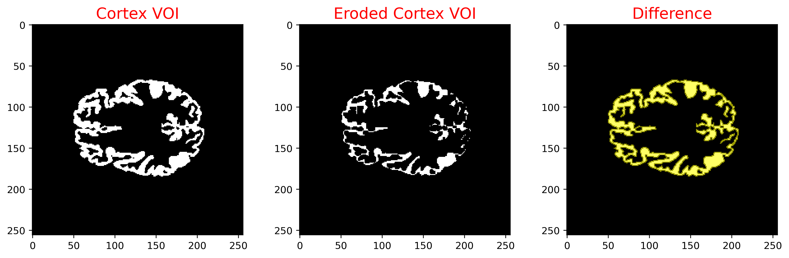

# Positrigo - Reconstruction Unit
## Image processing interface

This is an interfance to test and develop the image processing operations which form part of the Reconstruction Unit

## Features
- Import an input image (as a float binary file)
- Import an mask image ( as a float binary file - using only 0s and 1s)
- Apply an operation on input image or mask image
- Write result image to file (a float binary file)

## Requirements - Compile
The code has been developed and tested on unix systems, running Ubuntu 20.04.2 LTS.\
A shell script [Compile.sh](Compile.sh) is provided to compile the project

## Example input Images
The following 2D images have been created from the brain Zubal phantom [1]

[1] Zubal, I.G., Harrell, C.R, Smith, E.O, Rattner, Z., Gindi, G. and Hoffer, P.B., Computerized three-dimensional segmented human anatomy, Medical Physics, 21(2):299-302, 1994.

## Test cases for the erosion process
The image processing operations can be called using the **PositrigoRU-ImageProcessing** executable.\
Some examples on the usage of the erosion process are provided bellow.

```console
./PositrigoRU-ImageProcessing -mask Instructions/Cortex_2DVOI.img -dimx 256 -dimy 256 -dout Instructions/Cortex_eroded -process Erode:3
```


```console
./PositrigoRU-ImageProcessing -mask Instructions/Cortex_2DVOI.img -dimx 256 -dimy 256 -dout Instructions/Cortex_eroded -process Erode:7
```


```console
./PositrigoRU-ImageProcessing -mask Instructions/Thalamus_2DVOI.img -dimx 256 -dimy 256 -dout Instructions/Thalamus_eroded -process Erode:3
```


```console
./PositrigoRU-ImageProcessing -mask Instructions/Thalamus_2DVOI.img -dimx 256 -dimy 256 -dout Instructions/Thalamus_eroded -process Erode:7
```


### Viewing options
For the moment the toolkit is limited to I/O of binary image files.\
The same image files can be found within the [Testing](Testing) directory, along with interfile format header 
files (.hdr) that enable viewing of the examples with various viewing tools 
such as [Vinci](http://www.nf.mpg.de/vinci3/doc/vinci-about.html) or [Amide](http://amide.sourceforge.net).
Alternatively [Fiji/ImageJ](https://imagej.net/software/fiji) can be used for viewing of the binary image files directly.

# Discussion on Assignment questions


