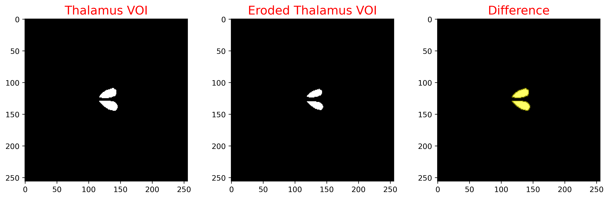

# Reconstruction Unit
## Image processing interface

This is an interfance to test and develop the image processing operations which form part of the Reconstruction Unit

## Features
- Import an input image (as a float binary file)
- Import an mask image ( as a float binary file - using only 0s and 1s)
- Apply an operation on input image or mask image
- Write result image to file (a float file)

## Requirements - Compile
The code has been developed and tested on unix systems, running Ubuntu 20.04.2 LTS.\
A shell script [Compile.sh](Compile.sh) is provided to compile the project

## Example input Images
The following 2D images have been created from the brain Zubal phantom [1]

[1] Zubal, I.G., Harrell, C.R, Smith, E.O, Rattner, Z., Gindi, G. and Hoffer, P.B., Computerized three-dimensional segmented human anatomy, Medical Physics, 21(2):299-302, 1994.

## Test cases for the erosion process
The image processing operations can be called using the **PositrigoRU-ImageProcessing** executable.\
Some examples on the usage of the erosion process are provided bellow.

```console
./PositrigoRU-ImageProcessing -mask Instructions/Cortex_2DVOI.img -dimx 256 -dimy 256 -dout Instructions/Cortex_eroded -process Erode:3
```


```console
./PositrigoRU-ImageProcessing -mask Instructions/Cortex_2DVOI.img -dimx 256 -dimy 256 -dout Instructions/Cortex_eroded -process Erode:7
```


```console
./PositrigoRU-ImageProcessing -mask Instructions/Thalamus_2DVOI.img -dimx 256 -dimy 256 -dout Instructions/Thalamus_eroded -process Erode:3
```


```console
./PositrigoRU-ImageProcessing -mask Instructions/Thalamus_2DVOI.img -dimx 256 -dimy 256 -dout Instructions/Thalamus_eroded -process Erode:7
```


### Viewing options
For the moment the toolkit is limited to I/O of binary image files.\
The same image files can be found within the [Testing](Testing) directory, along with interfile format header 
files (.hdr) that enable viewing of the examples with various viewing tools 
such as [Vinci](http://www.nf.mpg.de/vinci3/doc/vinci-about.html) or [Amide](http://amide.sourceforge.net).
Alternatively [Fiji/ImageJ](https://imagej.net/software/fiji) can be used for viewing of the binary image files directly.

example commands for these:
```console
./PositrigoRU-ImageProcessing -mask Testing/Cortex_2DVOI.img -dimx 256 -dimy 256 -dout Testing/Cortex_eroded -process Erode:3
./PositrigoRU-ImageProcessing -mask Testing/Thalamus_2DVOI.img -dimx 256 -dimy 256 -dout Testing/Thalamus_eroded -process Erode:3
```

# Discussion on Assignment questions
## Improvements on method definition
Some improvements in the definition have been made in this current implementation:
* The erode function has been encapsulated in a dedicated [Erode Class](./src/iImageProcessErode.cc).
* The Erode Class has been implemented as a specific child class of a generic (virtual) [image processing class](./src/vImageProcess.cc).
* An [image processing Manager](./src/ImageProcessingManager.cc) controls the application of the erosion, called within the flow of the main program. Checks on input and error messages are implemented within this process.
* The input/output images and their dimensions details are handled by a separate and dedicated [Image class](./src/ImageSpace.cc). 

Other improvements that can be made:
* The erosion and dilation processes make use of a modified convolution operation over the image space using a kernel/structuring element. The convolution process could be implemented in a generic way. Then these operations could be made using the same code, by simply changing the behaviour of the innermost convolution loop, and avoid code duplication.
* In this implementation the input mask images are in float format (even though only 1s and 0s are allowed). This was made to enable visualisation of the masks with regular viewing software. Ideally binary format images should be used internally, and an option should be provided for the output supporting different types/formats.
## Generic and type-safe method
* The current implementation of the erosion within the virtual imaging processing class allows for genericity, and enables the implementation of the remaining operations with only key components requiring coding. 
* Checks on the expected size of the input file against the provided input file are implemented, but are effective only for expected sizes that exceed the input image. These checks should be improved to check against the exact file size.
* The erode method (iImageProcessErode::ApplyProcess()) is type-safe as its input and output are controlled by the ImageProcessingManager
* The construction of the kernel/structuring elements is handled internally by the [Erode Class](./src/iImageProcessErode.cc) for creation of isotropic and square kernels only. A generic separate function should be defined to enable constructions or direct input of more complex kernel/structuring elements for different types of erosion operations. Furthermore an "on-the-fly" definition of spatially variant kernel should be also allowed, for different behaviour of erosion within the image space.
